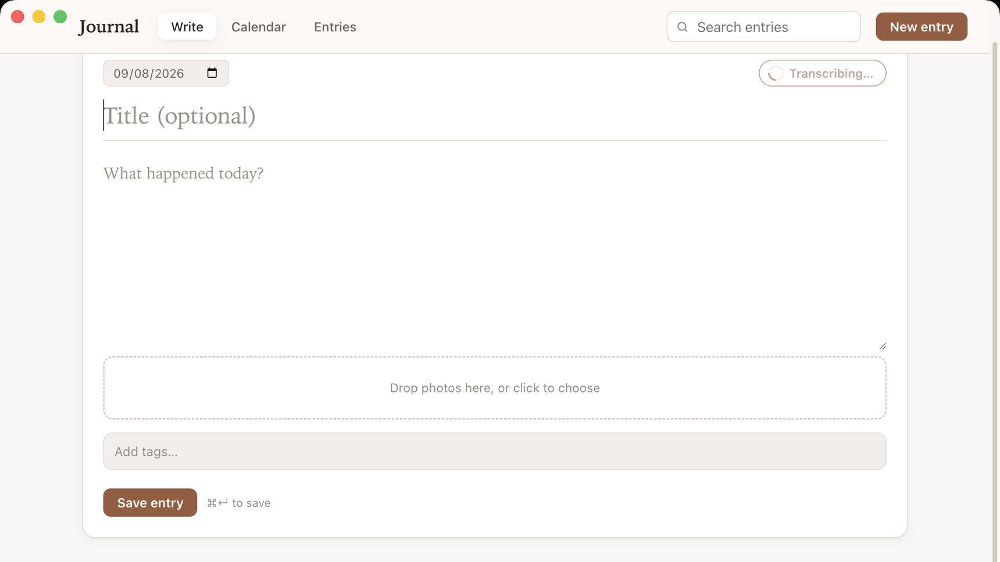

# Journal

**A private journal for your Mac.** Write about your day, add your photos, and
keep it all in a folder that belongs to you.

No account, no subscription, no feed. Journal never connects to the internet —
your words and photos stay on your Mac. You can type, or just talk and let it
write things down for you.

## Getting it

Download the `.dmg` from the **Releases** section of this page, open it, and drag
Journal into your Applications folder. You'll need a Mac with an Apple chip (M1
or newer).

The first time you open it, your Mac will warn you it's from an unidentified
developer — that's because Journal isn't sold through the App Store, not because
anything is wrong. Right-click the Journal icon, choose **Open**, and confirm.
Once only.

## Using it

**Calendar** shows the days you've written on, each with a photo from that day.
Click one to read it, or click an empty day to write something dated to it.

**Write** is where you type. Drag photos straight in or paste them. Tags are
optional, and make things easier to find later.

**Entries** lists everything you've written, newest first, with search and tags
at the top.

**Dictate** writes down what you say. The words appear as you speak; press `Esc`
to throw away a take. It all happens on your Mac — your voice is never sent
anywhere, and no recording is kept. What comes out is a rough first draft, meant
for tidying up afterwards.

| | |
|---|---|
| `⌘ N` | New entry |
| `⌘ S` | Save |
| `⌘ F` | Search |
| `⌘ 1` `⌘ 2` `⌘ 3` | Calendar · Write · Entries |

## Your files

Everything lives in a **Journal** folder inside your Documents — each entry a
text file, photos beside them. You can open them in TextEdit or anything else,
so you never need this app to read your own journal. To back it up, copy the
folder.

Photos are cropped square and made smaller when you add them, which keeps a year
of daily photos to a few hundred megabytes. That can't be undone, so keep your
original photos where you normally keep them.

---

[What's changed](CHANGELOG.md) · [For developers](docs/DEVELOPMENT.md) ·
[Licence](LICENSE)
