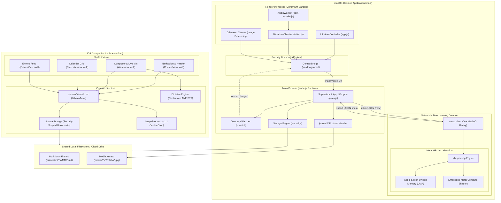
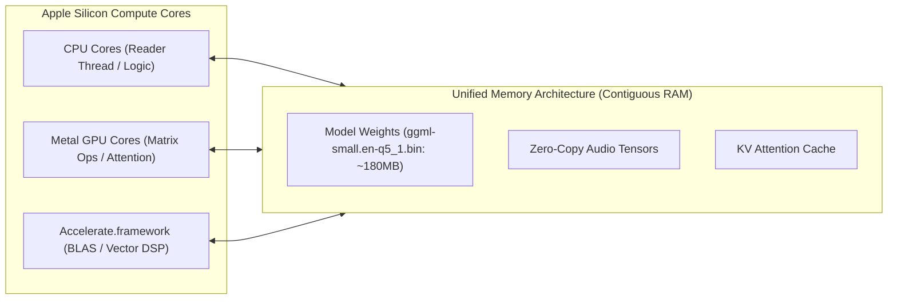
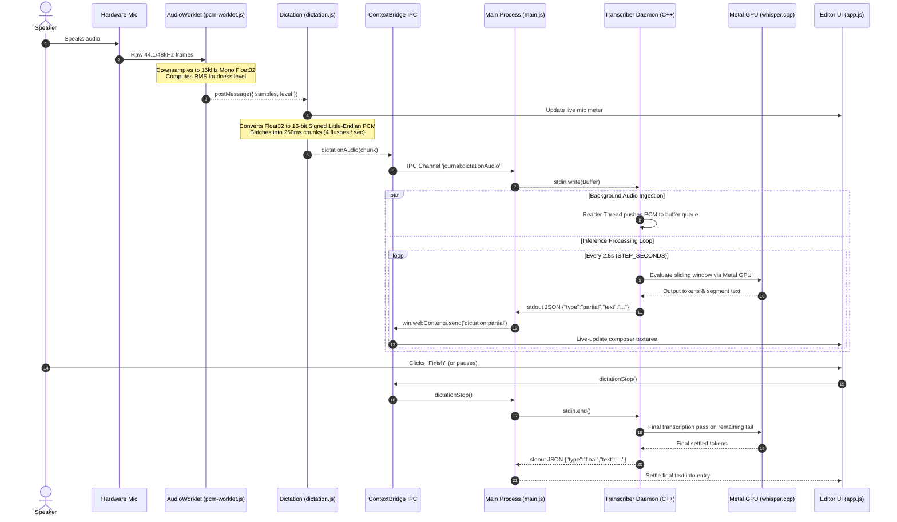
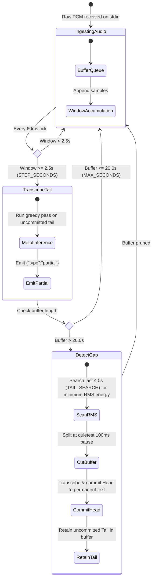
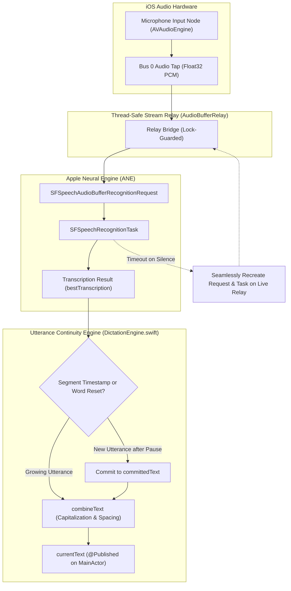
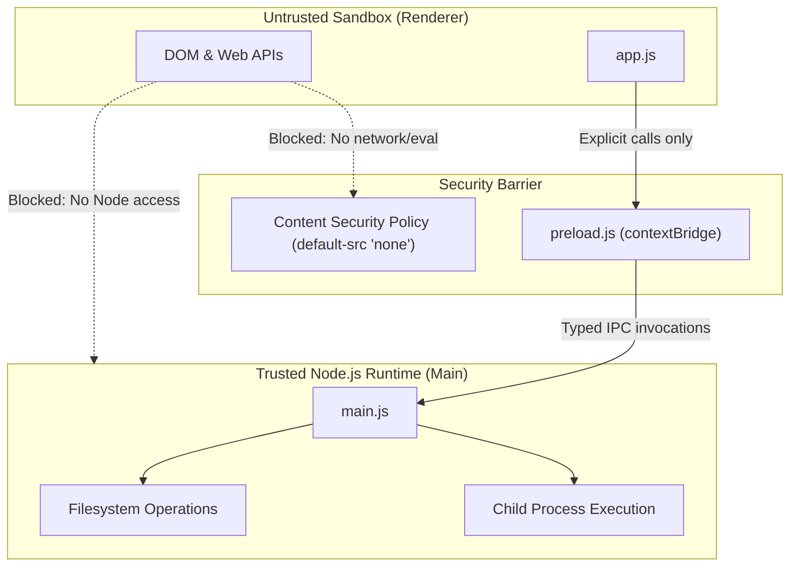
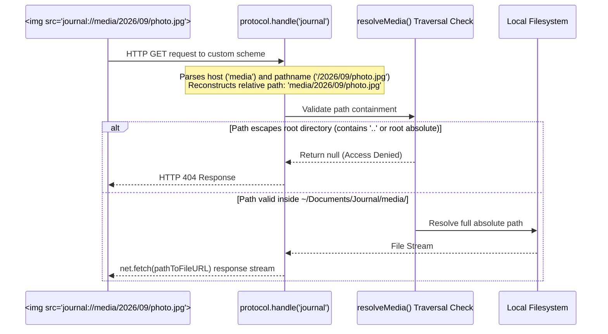
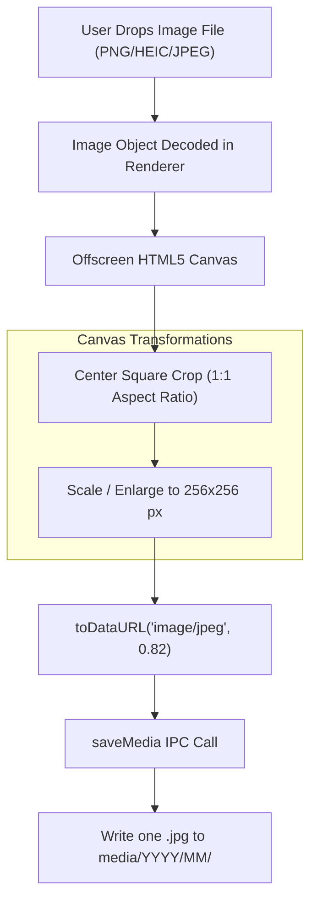
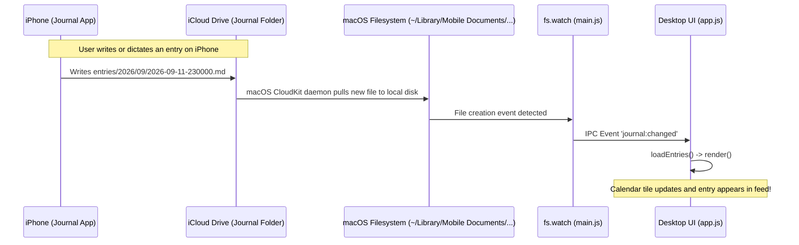
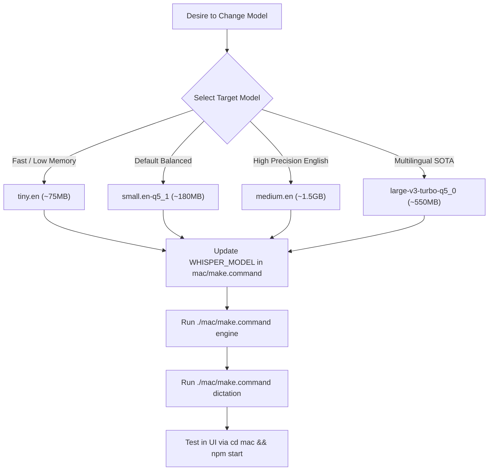

# Journal — System Design & Architecture Specification

A technical system design document detailing Journal's cross-platform architecture, hardware-accelerated on-device ML inference (Apple Metal GPU on macOS and Apple Neural Engine on iOS), IPC topologies, local-first storage design, and zero-cost iCloud Drive synchronization.

---

## 1. High-Level System Architecture

Journal is organized as a unified monorepo supporting two native clients sharing an identical, zero-database local file schema:
1. **macOS Desktop App (`mac/`)**: Three-tier architecture isolating a sandboxed Chromium renderer, native Node.js process supervisor, and embedded Metal GPU C++ ML inference daemon.
2. **iOS Companion App (`ios/`)**: Native SwiftUI application utilizing Apple Neural Engine (ANE) on-device speech recognition, security-scoped bookmarks, and reactive ViewModels.
3. **Storage Tier**: Plain Markdown files with frontmatter (`entries/YYYY/MM/*.md`) and downsampled JPEG media (`media/YYYY/MM/*.jpg`), synchronized bidirectionally across devices via iCloud Drive.



### Component Responsibility Matrix

| Platform | Component | Technology | Execution Context | Network / FS Access | Responsibilities |
| :--- | :--- | :--- | :--- | :--- | :--- |
| **macOS** | **Renderer** | HTML5, CSS3, Vanilla JS | Chromium Sandbox | None (`default-src 'none'`) | View rendering, SPA navigation, live UI state, microphone capture, image downsampling. |
| **macOS** | **AudioWorklet** | Web Audio API Worklet | Audio Render Thread | None | Off-main-thread Float32 sample gathering, RMS loudness calculation. |
| **macOS** | **Preload Bridge** | Electron `contextBridge` | Isolated Context | Controlled IPC only | Exposes typed `window.journal` API; enforces isolation barrier. |
| **macOS** | **Main Process** | Node.js, Electron APIs | Host Process | Local FS, Child Process | Window lifecycle, native menus, child process supervision, custom scheme handler, `fs.watch` sync. |
| **macOS** | **Storage Engine** | Node.js `fs.promises` | Main Process | Local FS (`~/Documents/Journal`) | Markdown parsing/serialization, directory hierarchy, media writes, path traversal checks. |
| **macOS** | **Transcriber** | C++17, whisper.cpp, Metal | Child Subprocess (`fork/exec`) | `stdin` / `stdout` only | Streaming audio ingest, silence gap detection, GPU-accelerated Whisper inference. |
| **iOS** | **SwiftUI Views** | SwiftUI | Main UI Thread | Memory only | Responsive layout, warm paper theme tokens, interactive calendar tiles, photo galleries, modal sheets. |
| **iOS** | **ViewModel** | Swift `@MainActor` | UI Actor | Memory / Storage Bridge | State management, active date/tag filters, photo selection, CRUD operations, reactive updates. |
| **iOS** | **Storage Engine** | Swift `FileManager` | Background Task | Security-Scoped Directory | Folder bookmark resolution, file coordination, markdown frontmatter serialization. |
| **iOS** | **Dictation Engine** | `AVAudioEngine`, `Speech` | Neural Engine & MainActor | Microphone Hardware | 100% on-device speech-to-text, audio buffer relay, pause survival, instant synchronous teardown on save. |
| **iOS** | **Image Processor** | `CGImageSource` / `CGImageDestination` | CPU / GPU CoreGraphics | Memory buffers | 1:1 centre-crop, single-tier JPEG compression (256x256 at 0.82). The picked original is not retained. |

---

## 2. Speech Engine & Apple Metal GPU Deep-Dive

### Hardware Acceleration Architecture (Apple Silicon UMA)

On Apple Silicon (M-series chips), the CPU, GPU, and Neural Engine share a contiguous, high-bandwidth **Unified Memory Architecture (UMA)**. Traditional discrete GPU pipelines suffer from PCIe transfer bottlenecks where audio buffers and weights must be duplicated across buses.



1. **Zero-Copy Tensor Evaluation**:
   `transcriber` allocates context buffers in system memory. Because Metal maps this unified address space directly, tensor kernels access weights and activations without memory copies.
2. **Embedded Metal Shaders**:
   Configured in `mac/native/CMakeLists.txt`:
   ```cmake
   set(GGML_METAL_EMBED_LIBRARY ON CACHE BOOL "" FORCE)
   ```
   During compilation, Apple's `metal` compiler translates `ggml-metal.metal` into `.air` intermediate representation, links it into a `.metallib`, and embeds it as a C byte array inside the Mach-O binary. At runtime, the application initializes the GPU pipeline with zero filesystem dependencies.
3. **GPU Context Activation**:
   In `mac/native/transcriber.cpp`:
   ```cpp
   whisper_context_params cparams = whisper_context_default_params();
   cparams.use_gpu = true; // Initializes MTLDevice and loads compute pipeline
   return whisper_init_from_file_with_params(path, cparams);
   ```

### Quantization & Memory Bandwidth Analysis

Transformer autoregressive decoding is memory-bandwidth bound. Every token generation step requires streaming the entire active model parameters through memory.

| Quantization Format | Model Size | Bandwidth Required / Token | Memory Footprint | Accuracy Relative to FP16 | Recommended Use Case |
| :--- | :--- | :--- | :--- | :--- | :--- |
| **FP16 (`small.en`)** | ~466 MB | ~466 MB | ~700 MB | 100% | Reference baseline |
| **Q5_1 (`small.en-q5_1`)** | **~180 MB** | **~180 MB** | **~260 MB** | **~99.2%** | **Production Default (Optimal efficiency)** |
| **Q4_0 (`base.en-q4_0`)** | ~80 MB | ~80 MB | ~140 MB | ~95.8% | Ultra-low power / Older hardware |
| **Q5_0 (`large-v3-turbo-q5_0`)** | ~550 MB | ~550 MB | ~850 MB | > 102% (multilingual) | Maximum multilingual accuracy |

*By utilizing 5-bit quantization (`q5_1`), Journal achieves a **~61% reduction in memory bandwidth consumption**, allowing inference to run significantly faster than real-time with negligible battery drain.*

### End-to-End Audio Ingestion & Inference Pipeline

The streaming audio path transfers data from the physical microphone down to the GPU compute pipeline:



### Sliding Window & Dynamic RMS Gap Slicing

Whisper processes audio in discrete blocks. To give the user live text while preventing unbounded memory growth during long recordings, `transcriber.cpp` implements a bounded sliding window with Root Mean Square (RMS) silence detection:



- **RMS Energy Calculation**:
  $$\text{RMS} = \sqrt{\frac{1}{N} \sum_{i=1}^{N} x_i^2} \quad \text{computed in 100ms sliding sub-windows}$$
- **Result**: Cuts happen during natural pauses between words rather than across phonemes, preventing hallucination or dropped syllables.

### 2.3 iOS On-Device Neural Dictation Architecture

The companion iOS app uses Apple's native `Speech` framework configured for 100% on-device neural transcription without external server queries (`requiresOnDeviceRecognition = true`).



1. **Continuous Stream Relay (`AudioBufferRelay`)**:
   `AVAudioEngine.inputNode` installs a tap once. Instead of tearing down the audio session when a recognition task completes or times out, `AudioBufferRelay` pipes audio buffers to whichever `SFSpeechAudioBufferRecognitionRequest` is currently active.
2. **Utterance Continuity Across Pauses**:
   When a user pauses mid-thought, Apple's speech recognizer flushes its partial transcription buffer and restarts recognition with a new utterance. `DictationEngine.swift` implements `shouldCommitPreviousHypothesis(newHypothesis:result:)`:
   - Inspects `result.bestTranscription.segments.first?.timestamp` relative to the previous hypothesis end time.
   - Detects when the first word changes after a silence gap.
   - Commits the previous phrase into `committedText` rather than allowing it to be overwritten.
3. **Smart Sentence Joining (`combineText`)**:
   - Preserves explicit newlines.
   - Adds single spaces between independent utterances.
   - Automatically capitalizes the first letter of subsequent utterances if preceding sentences end with `.`, `?`, or `!`.
4. **Instant Synchronous Teardown (`stopImmediately()`)**:
   When the user clicks "Save entry" while speaking:
   - Synchronously invalidates the timer and ends audio relay in **0ms**.
   - Commits in-flight hypothesis and updates `currentText`.
   - Halts `AVAudioEngine`, drops the audio tap, cancels the recognition task, and deactivates `AVAudioSession` (turning off the iOS microphone indicator immediately).
   - Returns the captured transcript immediately so `saveEntry()` persists it in the same runloop turn.

---

## 3. Web Application & Security Architecture

### Process Isolation & Security Perimeter

Journal operates under a strict principle of least privilege, preventing arbitrary code execution and ensuring offline privacy:



1. **Zero-Node Renderer**: `nodeIntegration: false`, `contextIsolation: true`. `window.require`, `process`, and `Buffer` do not exist in renderer scope.
2. **Offline Content Security Policy**:
   ```
   default-src 'none'; script-src 'self'; style-src 'self'; img-src journal: blob: data:; font-src 'self';
   ```
   No network requests (`fetch`, `XMLHttpRequest`, `WebSocket`) can be made to remote hosts.
3. **Navigation Lockdown**: External URLs clicked in markdown entries are blocked from rendering internally and redirected to macOS system default browser via `shell.openExternal()`.

### Custom Protocol: `journal://`

To display images without granting the renderer unrestricted `file://` access (which would allow reading arbitrary files on disk), Journal uses a secure custom protocol:



---

## 4. Local-First Storage & Media Pipeline

### Directory Hierarchy & Format Schema

Storage is completely transparent and file-manager friendly. No proprietary SQLite databases or binary blobs are used for entries.

```
~/Documents/Journal/
├── entries/
│   └── YYYY/
│       └── MM/
│           ├── YYYY-MM-DD-HHmmss.md        <-- Individual entry
│           └── YYYY-MM-DD-HHmmss.md
└── media/
    └── YYYY/
        └── MM/
            └── <uuid>.jpg                  <-- 256x256 square, the only copy kept
```

#### Markdown Format Schema

```yaml
---
id: 2026-09-08-143000          # Chronologically sortable string (YYYY-MM-DD-HHmmss)
date: 2026-09-08T14:30:00      # ISO local timestamp
title: Afternoon in Presidio   # Plaintext string
tags: nature, walking, fog     # Comma-delimited list
photos: media/2026/09/abc.jpg  # Relative paths to media directory
---

Entry body written in standard markdown...
```

### Client-Side Canvas Image Processing Pipeline

Images are transformed on an offscreen HTML5 `<canvas>` in the renderer before touching the disk. **The pipeline is single-tier: one 256x256 square per photo, and it is the only copy stored.** The file the writer picked is never written to disk, and the crop and downscale are not reversible — this is the one place the app destroys something it cannot get back, and it is a deliberate trade for a journal that stays small enough to sync and to keep forever.



- **Storage Efficiency**: 12MP smartphone photos (~5-10MB each) are reduced to roughly 15-30KB. A year of daily photos fits inside a few megabytes.
- **Undecodable Formats**: When Chromium cannot decode the file at all (some camera HEIC variants), the renderer stores it byte-for-byte as it arrived rather than losing the photo. Those entries keep their original extension and are the one case where a stored photo is not a 256px square.
- **One File Per Photo**: There is no separate `.thumb.jpg` tier. At 256px the stored square is already small enough to serve directly to the calendar and the feed, and a second tier would double the file count an iCloud sync has to reconcile. Journals written by earlier versions may still contain `.thumb.jpg` files; nothing references them, and they are safe to delete.

### iOS Image Processing Parity (`ImageProcessor.swift`)

On iOS, images picked via `PhotosPicker` undergo the same transformation in `ImageProcessor.process(rawImageData:)`:
1. Decodes with `CGImageSourceCreateThumbnailAtIndex` with `kCGImageSourceCreateThumbnailWithTransform: true` to honor EXIF orientation transforms, downsampling appropriately during decode.
2. Centre-crops to a square with `CGImage.cropping(to:)`:
   $$\text{side} = \min(\text{width}, \text{height}), \quad x = \frac{\text{width} - \text{side}}{2}, \quad y = \frac{\text{height} - \text{side}}{2}$$
3. Scales the crop to 256×256 px through a `CGContext` at `.high` interpolation (enlarging images with lower dimension < 256, downscaling larger images).
4. Encodes with `CGImageDestination` at `kCGImageDestinationLossyCompressionQuality = 0.82`.
5. Saves to `media/YYYY/MM/<uuid>.jpg` — the same single-file layout the Mac writes.

### Free Cross-Device iCloud Drive Synchronization

Journal achieves automatic, real-time cross-device sync between macOS and iOS with **zero server infrastructure** and **no paid Apple Developer Program fees**:



1. **Security-Scoped Bookmarks on iOS**:
   Instead of requiring proprietary iCloud container entitlements (`com.apple.developer.ubiquity-container-identifiers`), `JournalStorage.swift` stores a security-scoped bookmark (`URL.bookmarkData(options: .minimalBookmark)`) when the user selects their `Journal` folder in iCloud Drive. The app maintains permanent, sandboxed read/write permissions across launches.
2. **Recursive File Watcher on macOS**:
   `mac/src/main.js` monitors the `entries/` directory using Node's `fs.watch(..., { recursive: true })`. When iCloud delivers a new or edited file, the main process fires the `journal:changed` IPC event over the preload bridge.
3. **Live Sync Channel**:
   `mac/src/renderer/app.js` listens via `window.journal.onChanged(async () => { await loadEntries(); })`, seamlessly re-rendering the calendar and feed without requiring an application restart.
4. **Foreground Re-Sync on iOS**:
   `ContentView.swift` monitors SwiftUI's `scenePhase`. Whenever the app transitions to `.active`, it reloads entries from disk to ingest any changes made on the desktop.

### Desktop Calendar Filtering & Reactive Event Loop

The desktop calendar view allows users to click on any date tile to immediately filter the chronological feed to that specific date:

1. **Day Key Normalization (`dayKeyOf`)**:
   Entries created across different clients are normalized via regex:
   ```javascript
   function dayKeyOf(entry) {
     if (entry.id && /^\d{4}-\d{2}-\d{2}/.test(entry.id)) return entry.id.slice(0, 10);
     if (entry.date && /^\d{4}-\d{2}-\d{2}/.test(entry.date)) return entry.date.slice(0, 10);
     return (entry.id || entry.date || '').slice(0, 10);
   }
   ```
2. **Reactive View Transition**:
   When clicking a day cell with entries:
   ```javascript
   cell.addEventListener('click', () => {
     if (dayEntries.length) {
       state.dayFilter = key;
       state.search = '';
       state.activeTags.clear();
       $('#search').value = '';
       switchView('entries');
       render(); // Re-evaluates visibleEntries() and renders date chip in #filters
     } else {
       clearComposer();
       $('#date').value = key;
       switchView('write');
       $('#body').focus();
     }
   });
   ```
3. **Filter Reset**:
   Clicking the **Entries** button in the top navigation bar or pressing `⌘ 3` detects `state.dayFilter`, clears it to `null`, and calls `render()` to restore the full unconstrained feed.

---

## 5. Developer Runbook & Model Customization

### macOS Model Modification Workflow



#### Step 1: Update Build Configuration
Open `mac/make.command` and modify line 19:
```bash
WHISPER_MODEL="base.en"  # Or small.en-q5_1, tiny.en, large-v3-turbo-q5_0
```

#### Step 2: Download Weights & Recompile Helper
```bash
cd mac
./make.command engine
```
This triggers `mac/native/whisper.cpp/models/download-ggml-model.sh`, downloads the quantized weights into `mac/native/models/`, and recompiles `mac/native/build/transcriber` with embedded Metal shaders.

#### Step 3: Verify Inference Correctness
```bash
cd mac
./make.command dictation
```
Streams `jfk.wav` through the native transcriber and verifies that transcript tokens match expected output.

### Runtime Overrides (Without Recompilation)

Developers can test different configurations or external model weights dynamically using environment variables:

```bash
# Point to an external GGML model weight file:
JOURNAL_MODEL=/Volumes/Models/ggml-large-v3-turbo.bin npm --prefix mac start

# Point to an experimental C++ helper or debugging stub:
JOURNAL_TRANSCRIBER=/path/to/custom/transcriber npm --prefix mac start

# Override journal storage root to an isolated sandbox:
JOURNAL_ROOT=/tmp/test-journal npm --prefix mac start
```

### Parameter Tuning Reference (`mac/native/transcriber.cpp`)

| Parameter | Default | Trade-off When Decreased | Trade-off When Increased |
| :--- | :--- | :--- | :--- |
| `STEP_SECONDS` | `2.5f` | Faster UI feedback; higher GPU core utilization and power draw. | Lower CPU/GPU usage; longer latency before spoken words appear in UI. |
| `MAX_SECONDS` | `20.0f` | Less context retained for autoregressive guessing; lower RAM usage. | Better long-sentence phrasing; higher inference latency per step. |
| `TAIL_SEARCH` | `4.0f` | Narrower window to find silence; higher risk of cutting mid-word. | Slower gap detection; searches further back into spoken audio. |
| `threadCount()` | `4 to 8` | Slower token processing on CPU; less CPU core contention. | Faster CPU preprocessing; potential thread contention with Metal queue. |

### iOS Developer Runbook & Verification

#### Building & Compiling the iOS Target
```bash
DEVELOPER_DIR=/Applications/Xcode.app/Contents/Developer xcodebuild \
  -project ios/Journal.xcodeproj \
  -scheme Journal \
  -destination "generic/platform=iOS" \
  build
```

#### Executing Automated Verification Suites
The project includes standalone verification test suites under `ios/Tests/` validating data reciprocity and speech engine continuity. The format suite reads the shared fixtures in `spec/fixtures/`, so it must be run from the repository root — see [`docs/FORMAT.md`](FORMAT.md).

```bash
Or run all of them at once:

```bash
./ios/run-tests.sh
```

Individually:

```bash
# 0. Verify the entry format against the fixtures the Mac also checks:
DEVELOPER_DIR=/Applications/Xcode.app/Contents/Developer xcrun swiftc \
  -parse-as-library \
  ios/Tests/VerifyFormat.swift \
  ios/Journal/Models/Entry.swift \
  -o .cache/verify_format && .cache/verify_format

# 1. Verify DictationEngine pause survival, utterance continuity & instant teardown:
DEVELOPER_DIR=/Applications/Xcode.app/Contents/Developer xcrun swiftc \
  -parse-as-library \
  ios/Tests/VerifyDictationEngine.swift \
  ios/Journal/Audio/DictationEngine.swift \
  -o .cache/verify_dictation && .cache/verify_dictation

# 2. Verify Entry Markdown frontmatter serialization reciprocity:
DEVELOPER_DIR=/Applications/Xcode.app/Contents/Developer xcrun swiftc \
  ios/Tests/VerifyEntry.swift \
  ios/Journal/Models/Entry.swift \
  -o .cache/verify_entry && .cache/verify_entry

# 3. Verify JournalStorage security-scoped bookmark filesystem operations:
DEVELOPER_DIR=/Applications/Xcode.app/Contents/Developer xcrun swiftc \
  ios/Tests/VerifyStorage.swift \
  ios/Journal/Models/Entry.swift \
  ios/Journal/Models/JournalStorage.swift \
  -o .cache/verify_storage && .cache/verify_storage
```

---

## 6. Failure Modes & System Resilience

| Failure Scenario | Root Cause | System Defense / Recovery Mechanism |
| :--- | :--- | :--- |
| **Model Load Timeout** | Corrupt weights file or slow disk I/O | The helper reports `ready` *before* loading the model, so talking can begin immediately while the reader thread buffers. The 60s `readyTimer` therefore covers the helper failing to start at all; a model that fails to load afterwards emits `{"type":"error"}`, which the main process forwards to the window as `dictation:failed` so the take is closed rather than left running. |
| **Microphone Permission Denied** | macOS / iOS TCC privacy restriction | `main.js:ensureMicrophone()` checks `systemPreferences.getMediaAccessStatus('microphone')`. iOS `DictationEngine.requestAuthorization()` requests permission asynchronously. If denied, catches gracefully and prompts user with direct path to System Settings. |
| **Audio Input Overflow** | Whisper inference pass takes longer than audio ingestion | Audio read loop runs on a detached `std::thread reader` pushing to a thread-safe mutex-guarded queue. Audio is never dropped from `stdin`. |
| **Canvas Pixel Tainting** | Attempting to read pixels from `journal://` origin | Canvas crops and compresses raw image data *before* converting to `journal://` URLs. Storage returns paths; renderer never reads raw pixels from custom protocols. |
| **Filesystem Disconnection** | External drive holding Journal unplugged | `main.js:resolveRoot()` detects missing directory on startup and safely falls back to local `~/Documents/Journal` without crashing. |
| **Subprocess Crash** | Segmentation fault or out-of-memory in C++ helper | Main process listens to `child.on('close')`. Slices whatever text was accumulated so far and resolves final promise; user never loses spoken text. |
| **Speech Pause Timeout (iOS)** | Apple Neural Engine closes utterance after silence (`kAFAssistantErrorDomain 1110/203`) | `DictationEngine` detects silence timeout, commits previous hypothesis into `committedText`, and immediately restarts recognition task on the still-running audio tap without session teardown. |
| **Instant Save While Speaking (iOS)** | User clicks "Save entry" while dictation is actively recording | `WriteView.saveEntry()` calls `stopImmediately()`, which synchronously captures in-flight words, halts `AVAudioEngine`, deactivates `AVAudioSession`, and writes the entry to disk in **0ms**. |
| **iCloud Bookmark Stale (iOS)** | User changes iCloud account or deletes remote folder | `JournalStorage` catches security-scoped bookmark resolution failures and gracefully falls back to the app's local sandbox `Documents` directory without data loss. |

