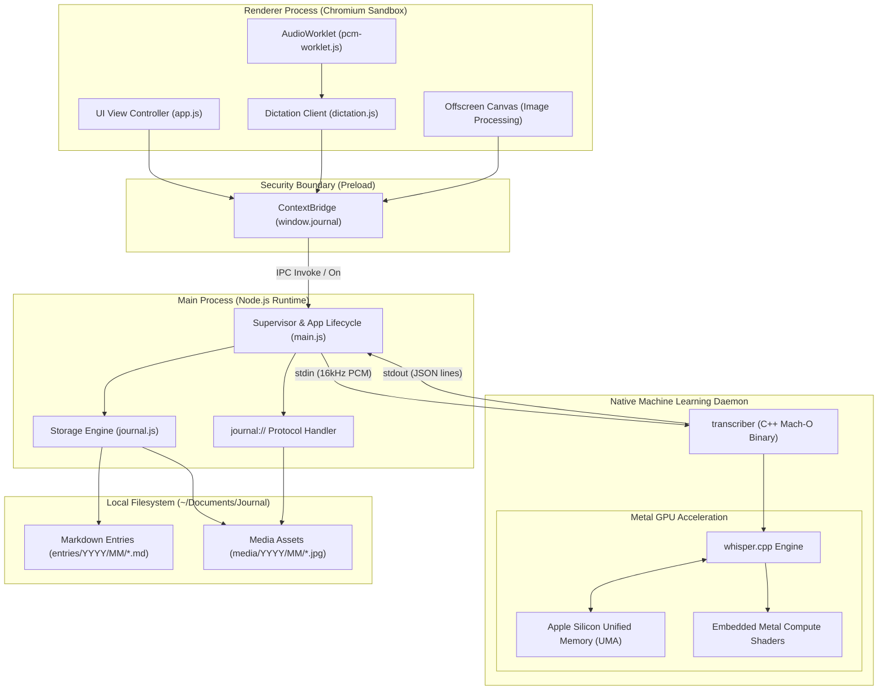
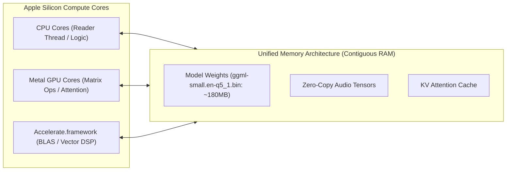
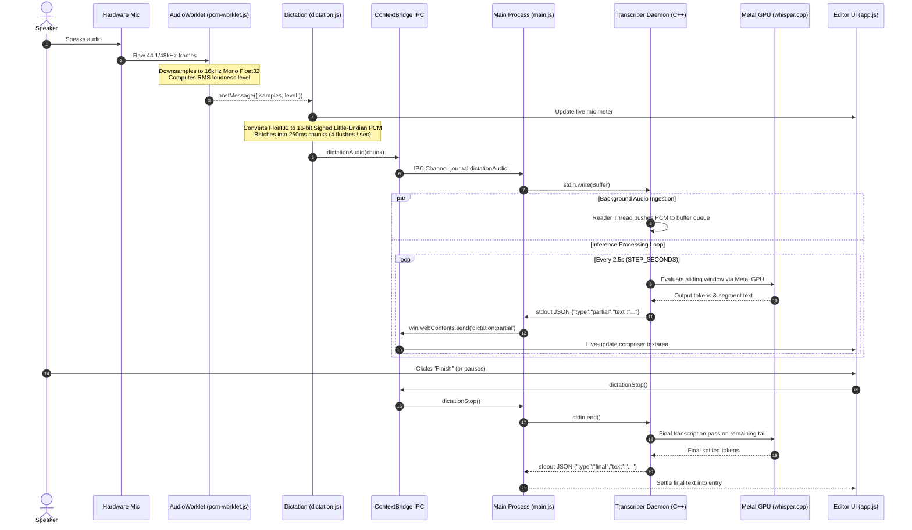
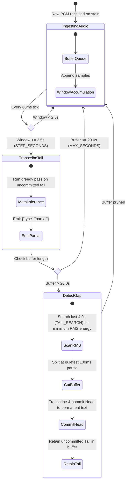
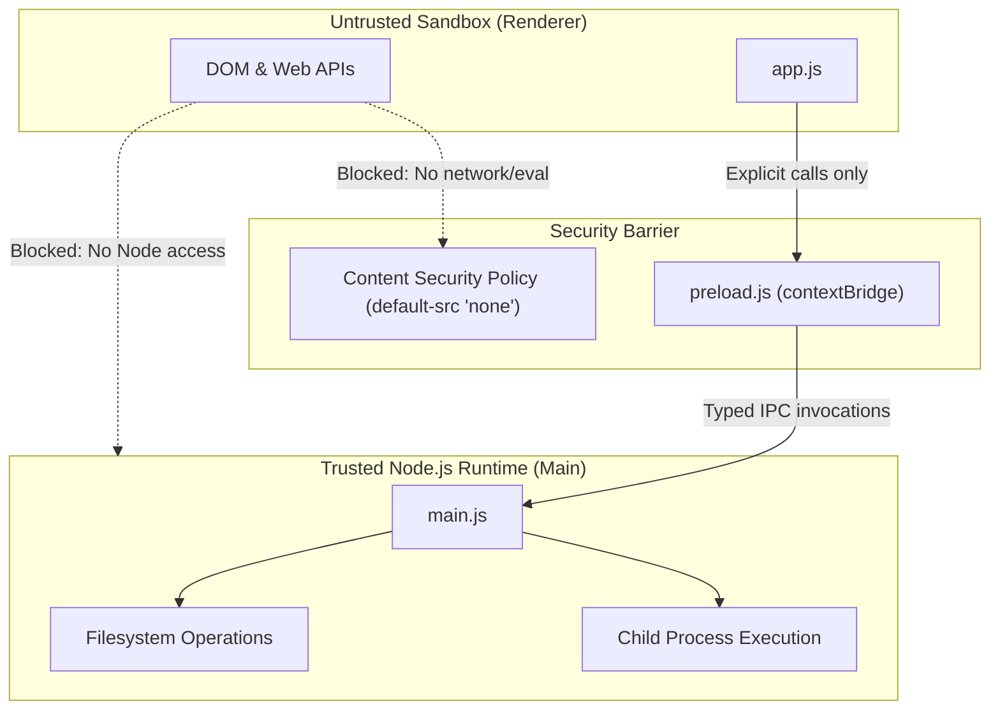
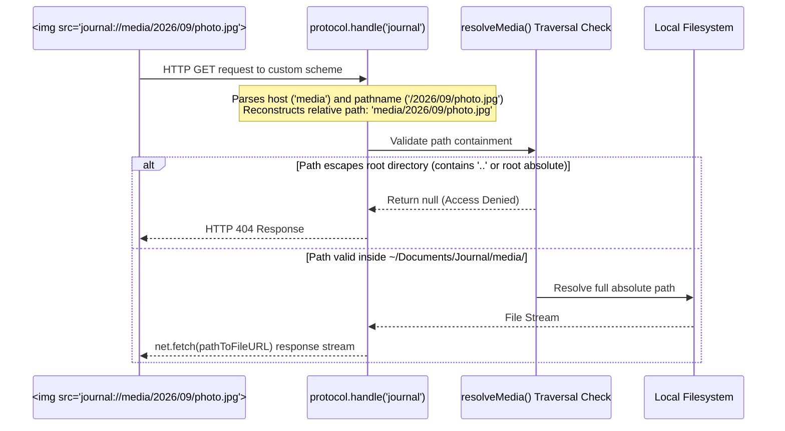
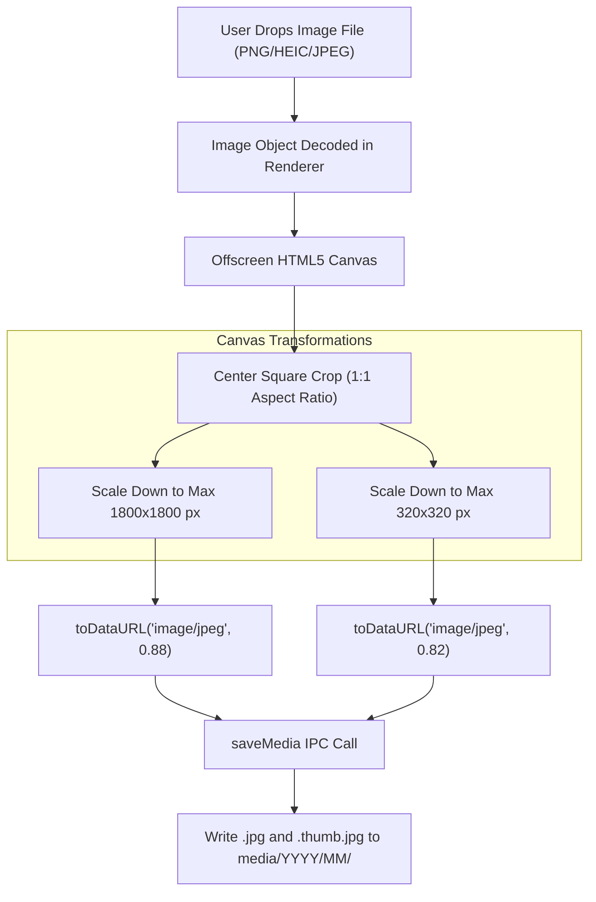
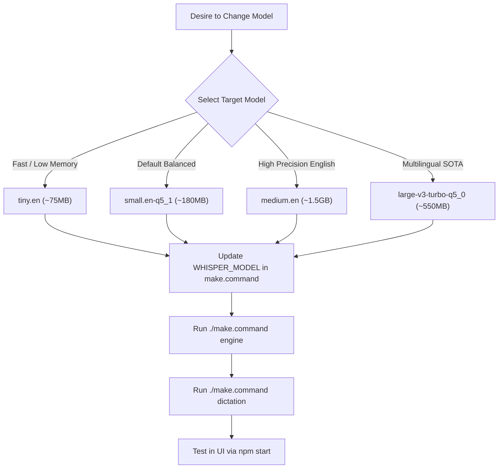

# Journal — System Design & Architecture Specification

A technical system design document detailing Journal's architecture, hardware-accelerated on-device ML inference via Apple Metal GPU, IPC communication topologies, and local-first storage design.

---

## 1. High-Level System Architecture

Journal is structured around a three-tier process topology isolating the web runtime, native Node.js capabilities, and hardware-accelerated native compute.



### Component Responsibility Matrix

| Component | Technology | Execution Context | Network / FS Access | Responsibilities |
| :--- | :--- | :--- | :--- | :--- |
| **Renderer** | HTML5, CSS3, Vanilla JS | Chromium Sandbox | None (`default-src 'none'`) | View rendering, SPA navigation, live UI state, microphone capture, image downsampling. |
| **AudioWorklet** | Web Audio API Worklet | Audio Render Thread | None | Off-main-thread Float32 sample gathering, RMS loudness calculation. |
| **Preload Bridge** | Electron `contextBridge` | Isolated Context | Controlled IPC only | Exposes typed `window.journal` API; enforces isolation barrier. |
| **Main Process** | Node.js, Electron APIs | Host Process | Local FS, Child Process | Window lifecycle, native menus, child process supervision, custom scheme handler. |
| **Storage Engine** | Node.js `fs.promises` | Main Process | Local FS (`~/Documents/Journal`) | Markdown parsing/serialization, directory hierarchy, media writes, path traversal checks. |
| **Transcriber** | C++17, whisper.cpp, Metal | Child Subprocess (`fork/exec`) | `stdin` / `stdout` only | Streaming audio ingest, silence gap detection, GPU-accelerated Whisper inference. |

---

## 2. Speech Engine & Apple Metal GPU Deep-Dive

### Hardware Acceleration Architecture (Apple Silicon UMA)

On Apple Silicon (M-series chips), the CPU, GPU, and Neural Engine share a contiguous, high-bandwidth **Unified Memory Architecture (UMA)**. Traditional discrete GPU pipelines suffer from PCIe transfer bottlenecks where audio buffers and weights must be duplicated across buses.



1. **Zero-Copy Tensor Evaluation**:
   `transcriber` allocates context buffers in system memory. Because Metal maps this unified address space directly, tensor kernels access weights and activations without memory copies.
2. **Embedded Metal Shaders**:
   Configured in `native/CMakeLists.txt`:
   ```cmake
   set(GGML_METAL_EMBED_LIBRARY ON CACHE BOOL "" FORCE)
   ```
   During compilation, Apple's `metal` compiler translates `ggml-metal.metal` into `.air` intermediate representation, links it into a `.metallib`, and embeds it as a C byte array inside the Mach-O binary. At runtime, the application initializes the GPU pipeline with zero filesystem dependencies.
3. **GPU Context Activation**:
   In `native/transcriber.cpp`:
   ```cpp
   whisper_context_params cparams = whisper_context_default_params();
   cparams.use_gpu = true; // Initializes MTLDevice and loads compute pipeline
   return whisper_init_from_file_with_params(path, cparams);
   ```

### Quantization & Memory Bandwidth Analysis

Transformer autoregressive decoding is memory-bandwidth bound. Every token generation step requires streaming the entire active model parameters through memory.

| Quantization Format | Model Size | Bandwidth Required / Token | Memory Footprint | Accuracy Relative to FP16 | Recommended Use Case |
| :--- | :--- | :--- | :--- | :--- | :--- |
| **FP16 (`small.en`)** | ~466 MB | ~466 MB | ~700 MB | 100% | Reference baseline |
| **Q5_1 (`small.en-q5_1`)** | **~180 MB** | **~180 MB** | **~260 MB** | **~99.2%** | **Production Default (Optimal efficiency)** |
| **Q4_0 (`base.en-q4_0`)** | ~80 MB | ~80 MB | ~140 MB | ~95.8% | Ultra-low power / Older hardware |
| **Q5_0 (`large-v3-turbo-q5_0`)** | ~550 MB | ~550 MB | ~850 MB | > 102% (multilingual) | Maximum multilingual accuracy |

*By utilizing 5-bit quantization (`q5_1`), Journal achieves a **~61% reduction in memory bandwidth consumption**, allowing inference to run significantly faster than real-time with negligible battery drain.*

### End-to-End Audio Ingestion & Inference Pipeline

The streaming audio path transfers data from the physical microphone down to the GPU compute pipeline:



### Sliding Window & Dynamic RMS Gap Slicing

Whisper processes audio in discrete blocks. To give the user live text while preventing unbounded memory growth during long recordings, `transcriber.cpp` implements a bounded sliding window with Root Mean Square (RMS) silence detection:



- **RMS Energy Calculation**:
  $$\text{RMS} = \sqrt{\frac{1}{N} \sum_{i=1}^{N} x_i^2} \quad \text{computed in 100ms sliding sub-windows}$$
- **Result**: Cuts happen during natural pauses between words rather than across phonemes, preventing hallucination or dropped syllables.

---

## 3. Web Application & Security Architecture

### Process Isolation & Security Perimeter

Journal operates under a strict principle of least privilege, preventing arbitrary code execution and ensuring offline privacy:



1. **Zero-Node Renderer**: `nodeIntegration: false`, `contextIsolation: true`. `window.require`, `process`, and `Buffer` do not exist in renderer scope.
2. **Offline Content Security Policy**:
   ```
   default-src 'none'; script-src 'self'; style-src 'self'; img-src journal: blob: data:; font-src 'self';
   ```
   No network requests (`fetch`, `XMLHttpRequest`, `WebSocket`) can be made to remote hosts.
3. **Navigation Lockdown**: External URLs clicked in markdown entries are blocked from rendering internally and redirected to macOS system default browser via `shell.openExternal()`.

### Custom Protocol: `journal://`

To display images without granting the renderer unrestricted `file://` access (which would allow reading arbitrary files on disk), Journal uses a secure custom protocol:



---

## 4. Local-First Storage & Media Pipeline

### Directory Hierarchy & Format Schema

Storage is completely transparent and file-manager friendly. No proprietary SQLite databases or binary blobs are used for entries.

```
~/Documents/Journal/
├── entries/
│   └── YYYY/
│       └── MM/
│           ├── YYYY-MM-DD-HHmmss.md        <-- Individual entry
│           └── YYYY-MM-DD-HHmmss.md
└── media/
    └── YYYY/
        └── MM/
            ├── <uuid>.jpg                  <-- Full-resolution photo
            └── <uuid>.thumb.jpg            <-- Low-latency thumbnail
```

#### Markdown Format Schema

```yaml
---
id: 2026-09-08-143000          # Chronologically sortable string (YYYY-MM-DD-HHmmss)
date: 2026-09-08T14:30:00      # ISO local timestamp
title: Afternoon in Presidio   # Plaintext string
tags: nature, walking, fog     # Comma-delimited list
photos: media/2026/09/abc.jpg  # Relative paths to media directory
---

Entry body written in standard markdown...
```

### Client-Side Canvas Image Processing Pipeline

To maintain high performance without disk bloat, images are transformed on an offscreen HTML5 `<canvas>` in the renderer before touching the disk:



- **Storage Efficiency**: Uncompressed 12MP smartphone photos (~5-10MB each) are compressed to ~300KB for full resolution and ~25KB for thumbnails. A year of daily photos fits inside ~120MB.
- **Fast Calendar Loading**: The calendar view loads exclusively `.thumb.jpg` assets, eliminating memory pressure and frame drops during fast scrolling.

---

## 5. Developer Runbook & Model Customization

### Model Modification Workflow



#### Step 1: Update Build Configuration
Open `make.command` and modify line 19:
```bash
WHISPER_MODEL="base.en"  # Or small.en-q5_1, tiny.en, large-v3-turbo-q5_0
```

#### Step 2: Download Weights & Recompile Helper
```bash
./make.command engine
```
This triggers `native/whisper.cpp/models/download-ggml-model.sh`, downloads the quantized weights into `native/models/`, and recompiles `native/build/transcriber` with embedded Metal shaders.

#### Step 3: Verify Inference Correctness
```bash
./make.command dictation
```
Streams `jfk.wav` through the native transcriber and verifies that transcript tokens match expected output.

### Runtime Overrides (Without Recompilation)

Developers can test different configurations or external model weights dynamically using environment variables:

```bash
# Point to an external GGML model weight file:
JOURNAL_MODEL=/Volumes/Models/ggml-large-v3-turbo.bin npm start

# Point to an experimental C++ helper or debugging stub:
JOURNAL_TRANSCRIBER=/path/to/custom/transcriber npm start

# Override journal storage root to an isolated sandbox:
JOURNAL_ROOT=/tmp/test-journal npm start
```

### Parameter Tuning Reference (`native/transcriber.cpp`)

| Parameter | Default | Trade-off When Decreased | Trade-off When Increased |
| :--- | :--- | :--- | :--- |
| `STEP_SECONDS` | `2.5f` | Faster UI feedback; higher GPU core utilization and power draw. | Lower CPU/GPU usage; longer latency before spoken words appear in UI. |
| `MAX_SECONDS` | `20.0f` | Less context retained for autoregressive guessing; lower RAM usage. | Better long-sentence phrasing; higher inference latency per step. |
| `TAIL_SEARCH` | `4.0f` | Narrower window to find silence; higher risk of cutting mid-word. | Slower gap detection; searches further back into spoken audio. |
| `threadCount()` | `4 to 8` | Slower token processing on CPU; less CPU core contention. | Faster CPU preprocessing; potential thread contention with Metal queue. |

---

## 6. Failure Modes & System Resilience

| Failure Scenario | Root Cause | System Defense / Recovery Mechanism |
| :--- | :--- | :--- |
| **Model Load Timeout** | Corrupt weights file or slow disk I/O | Main process maintains a 60s timeout timer (`readyTimer`). If unready, kills child process with `SIGTERM` and displays actionable diagnostic alert. |
| **Microphone Permission Denied** | macOS TCC privacy restriction | `main.js:ensureMicrophone()` checks `systemPreferences.getMediaAccessStatus('microphone')`. If denied, catches gracefully and prompts user with direct path to System Settings. |
| **Audio Input Overflow** | Whisper inference pass takes longer than audio ingestion | Audio read loop runs on a detached `std::thread reader` pushing to a thread-safe mutex-guarded queue. Audio is never dropped from `stdin`. |
| **Canvas Pixel Tainting** | Attempting to read pixels from `journal://` origin | Canvas crops and compresses raw image data *before* converting to `journal://` URLs. Storage returns paths; renderer never reads raw pixels from custom protocols. |
| **Filesystem Disconnection** | External drive holding Journal unplugged | `main.js:resolveRoot()` detects missing directory on startup and safely falls back to local `~/Documents/Journal` without crashing. |
| **Subprocess Crash** | Segmentation fault or out-of-memory in C++ helper | Main process listens to `child.on('close')`. Slices whatever text was accumulated so far and resolves final promise; user never loses spoken text. |
